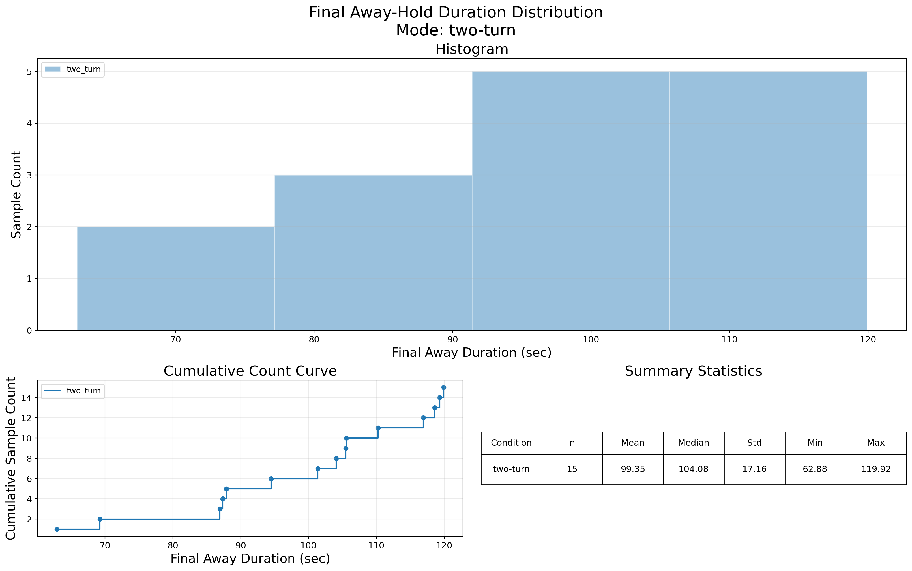
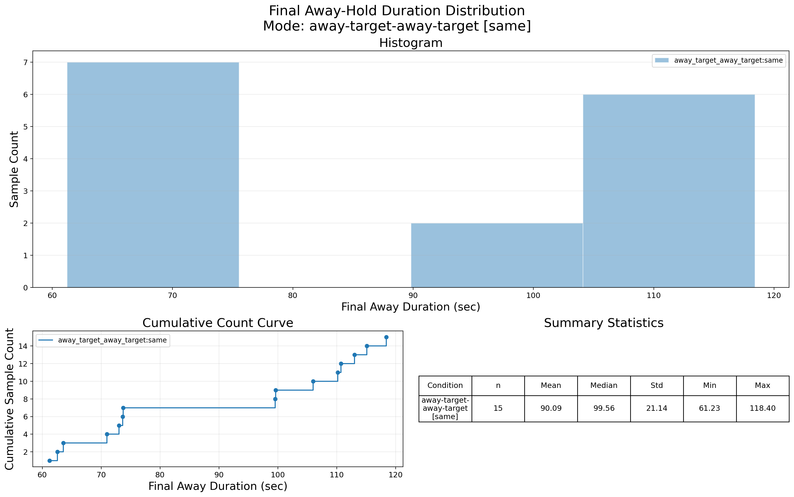
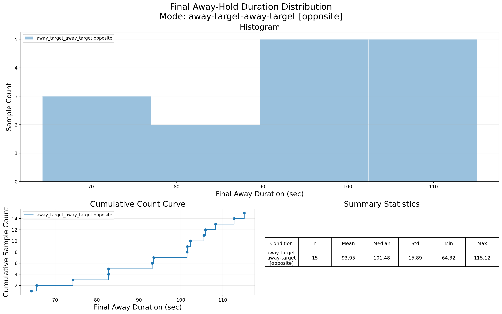

# Panorama Video Processing

This project converts 360-degree equirectangular panorama videos into perspective-view probe videos for constructing memory-test videos that follow a "look at target / look away, then return to target" paradigm.

The core challenge of the current implementation is not generating ordinary camera roaming, but rather controlling the temporal order, intervals, and final prediction window of the target FOV and away FOV on the timeline, making it convenient to test whether a model can remember a field of view that appeared earlier.

## Data And Sample Outputs

The test videos in `test_data/` come from the following Hugging Face dataset:

```text
https://huggingface.co/datasets/quchenyuan/360x_dataset_LR/tree/main
```

Here, `test_data\` only showcases 3 low-resolution 360x panorama videos。

Supported video formats:

```text
.mp4, .mov, .m4v, .mkv, .avi, .webm
```

`sample_outputs/` only shows the three mode outputs for the first test video. It is used to quickly inspect the visual effects of the three modes: 
- `two_turn`
- `away_target_away_target` with `same`
- `away_target_away_target` with `opposite`

## Code Structure

Main scripts:

- `panorama_video_process.py`: Generates the three kinds of probe videos and writes out metadata.
- `visualize_last_away_duration.py`: Plots the distribution of final away-hold duration from the metadata JSONL.
- `requirements.txt`: Python dependencies.

Output directory structure:

```text
outputs/panorama_video_process/outputs_<run-timestamp>/
```

Each run writes out:

- generated `.mp4` videos
- `<run-timestamp>_metadata.jsonl`
- `<run-timestamp>_extracted_metadata.jsonl`
- `<run-timestamp>_errors.jsonl`, only if some videos fail

## Experimental Modes

The current code contains two CLI modes, but they correspond to three experimental conditions:

```text
1. two_turn
2. away_target_away_target + away_pair_mode=same
3. away_target_away_target + away_pair_mode=opposite
```

### 1. `two_turn`: target-away-target

Temporal order:

```text
target hold
  -> smooth turn to away
  -> away hold
  -> smooth turn back to target
  -> final target hold
```

The goal of this condition is: the target is seen from the very first frame, then the view leaves the target, and finally, within the prediction window, the view turns back to the same target from the away direction.

### 2. `away_target_away_target` + `same`

Temporal order:

```text
entry away hold
  -> smooth turn to target
  -> middle target hold
  -> smooth turn to exit away
  -> exit away hold
  -> smooth turn back to target
  -> final target hold
```

`same`  means the entry away and exit away use the same away yaw and away FOV.

### 3. `away_target_away_target` + `opposite`

The temporal order is the same as `same`：

```text
entry away hold
  -> smooth turn to target
  -> middle target hold
  -> smooth turn to exit away
  -> exit away hold
  -> smooth turn back to target
  -> final target hold
```

`opposite` means the entry away and exit away lie in opposite directions relative to the target: if the entry away is the target yaw plus a positive delta, then the exit away uses a negative delta, and vice versa. The FOV sizes of the two away segments are identical, but their yaws differ.

## Angle And FOV Design

### Target yaw

The target yaw is sampled from `--target-yaw-deg-range`, whose default is:

```text
-180.0,180.0
```

After sampling, it is normalized to `[-180, 180)`. This means the target can appear at any horizontal angle in the panorama.

### Away yaw

The away yaw is obtained by adding a yaw delta to the target yaw:

```text
away_yaw = normalize(target_yaw +/- away_yaw_delta)
```
The absolute value is sampled from `--away-yaw-delta-deg-range` .  The default range differs by mode:

- `two_turn`: `130.0,150.0`
- `away_target_away_target`: `118.0,122.0`

The sign of the delta:
- In `two_turn`, the sign of the delta is chosen randomly.
- In `away_target_away_target` same, the sign of the entry-away delta is random, and the exit-away delta matches the entry-away delta in both sign and absolute value.
- In `away_target_away_target` opposite, the entry away and exit away use opposite delta signs, and the absolute delta values are sampled independently.

### FOV

Target FOV and away FOV are each randomly sampled from a range:

- `two_turn` default target/away FOV range: `100.0,110.0`
- `away_target_away_target` default target/away FOV range: `95.0,105.0`


The current implementation has two important constraints:

- Within the same output video, the two target segments in `away_target_away_target` mode use the same target FOV.
- Within the same output video, the two away segments use the same away FOV.

### Non-overlapping

The default yaw-delta and FOV-range designs ensure that the target FOV and away FOV do not overlap horizontally. In other words, the target field of view and the away field of view are separate; they will not see the same region because the FOV is too wide.

### No vertical translation

Currently, only horizontal yaw rotation is performed between target and away. No path involving pitch change—such as "upper-left / lower-left"—is designed.

``--pitch-deg`` and `--roll-deg` remain constant throughout the output video, both defaulting to `0.0`.

## Duration Design

### Smooth rotation

All transitions between target and away use `smoothstep`:


```text
weight = smoothstep(progress)
yaw    = lerp_yaw(start_yaw, end_yaw, weight)
fov_x  = lerp(start_fov, end_fov, weight)
```

During rotation, the ease-in/ease-out shape of smoothstep is preserved; the average rotation speed is controlled by `--turn-speed-deg-per-sec`, whose current default is:

```text
60.0 deg/sec
```

Therefore, the duration of each rotation is determined by the yaw delta:

```text
turn_duration_sec = abs(yaw_delta_deg) / turn_speed_deg_per_sec
```

### Prediction window

`--prediction-window-sec` defaults to：

```text
5.0 sec
```

This prediction window sits at the final segment of the video and includes: the rotation from final away back to target + the final hold duration on target.

### Initial / middle target duration

In `two_turn`, the first target hold is at least:


```text
--initial-target-min-sec 5.0
```

If the video is too short, the script will error out or clamp the away hold.

In `away_target_away_target`, the middle target hold is at least:

```text
--middle-target-hold-sec 5.0
```

When the available duration allows, any extra non-prediction-window time is allocated to the middle target hold.

### Final away duration

Final away duration is a crucial control variable in this design: it determines how long the model sees only the away field of view before finally returning to target.

The default final away hold range is:

```text
60.0,120.0
```

In `two_turn`, this corresponds to `away_hold_sec`.

In `away_target_away_target`, this corresponds to `exit_away_hold_sec`; additionally, the starting `entry_away_hold_sec` defaults to:

```text
3.0,5.0
```

If the total input video duration is insufficient to simultaneously satisfy all holds, rotations, and the prediction window, the code records clamped fields in the metadata, such as `away_hold_clamped`, `entry_away_hold_clamped`, or `exit_away_hold_clamped`.

## Install

Create and activate a Python environment if needed:

```bash
python3 -m venv .venv
source .venv/bin/activate
```

Install dependencies:

```bash
pip install -r requirements.txt
```

The script uses:

- `opencv-python` for video reading and writing
- `numpy`
- `equilib` for equirectangular-to-perspective projection

## Quick Start

Generate `two_turn` videos:

```bash
python panorama_video_process.py test_data \
  --mode two_turn
```

Generate `away_target_away_target` with the same away view:

```bash
python panorama_video_process.py test_data \
  --mode away_target_away_target \
  --away-pair-mode same
```

Generate `away_target_away_target` with opposite away views:

```bash
python panorama_video_process.py test_data \
  --mode away_target_away_target \
  --away-pair-mode opposite
```

Generate one variant for a single video:

```bash
python panorama_video_process.py test_data/019cc67f-512f-4b8a-96ef-81f806c86ce1.mp4 \
  --mode two_turn
```

Use a fixed timestamp and overwrite existing files from that timestamp:

```bash
python panorama_video_process.py test_data \
  --mode two_turn \
  --run-timestamp 202607251246 \
  --overwrite
```

Generate several variants per input video:

```bash
python panorama_video_process.py test_data \
  --mode away_target_away_target \
  --away-pair-mode opposite \
  --variants-per-video 3
```

## Useful Parameters

| Parameter | Meaning | Default |
| --- | --- | --- |
| `input` | Input video file or directory | required |
| `--output-dir` | Base output folder | `outputs/panorama_video_process` |
| `--run-timestamp` | Timestamp used in output names | current time |
| `--seed` | Global random seed | `42` |
| `--mode` | `two_turn` or `away_target_away_target` | `two_turn` |
| `--away-pair-mode` | `same` or `opposite`, only used by `away_target_away_target` | `same` |
| `--variants-per-video` | Number of outputs per source video | `1` |
| `--target-yaw-deg-range` | Target yaw sampling range | `-180.0,180.0` |
| `--away-yaw-delta-deg-range` | Away yaw delta range | mode-dependent |
| `--away-hold-sec-range` | Final away hold duration range | `60.0,120.0` |
| `--entry-away-hold-sec-range` | Initial away hold range for `away_target_away_target` | `3.0,5.0` |
| `--initial-target-min-sec` | Minimum first target hold for `two_turn` | `5.0` |
| `--middle-target-hold-sec` | Minimum middle target hold for `away_target_away_target` | `5.0` |
| `--prediction-window-sec` | Final prediction window duration | `5.0` |
| `--turn-speed-deg-per-sec` | Average rotation speed | `60.0` |
| `--target-fov-x-deg-range` | Target horizontal FOV range | mode-dependent |
| `--away-fov-x-deg-range` | Away horizontal FOV range | mode-dependent |
| `--pitch-deg` | Constant pitch angle | `0.0` |
| `--roll-deg` | Constant roll angle | `0.0` |
| `--overwrite` | Replace existing outputs with the same names | off |
| `--strict` | Stop on the first failed video | off |

Mode-dependent defaults:

| Mode | `--away-yaw-delta-deg-range` | FOV range |
| --- | --- | --- |
| `two_turn` | `130.0,150.0` | `100.0,110.0` |
| `away_target_away_target` | `118.0,122.0` | `95.0,105.0` |

All range arguments use this format:

```text
low,high
```

Do not add spaces inside the range unless your shell handles them safely.

## Metadata

The metadata file is JSON Lines. Each generated video has one JSON record.

Important common fields include:

- `sample_id`
- `source_video`
- `output_video`
- `mode`
- `seed`
- `variant_index`
- `target_yaw_deg`
- `target_fov_x_deg`
- `prediction_window_start_sec`
- `prediction_window_sec`
- `turn_speed_deg_per_sec`

Important `two_turn` fields:

- `away_yaw_deg`
- `away_yaw_delta_deg`
- `away_fov_x_deg`
- `target_hold_sec`
- `turn_away_duration_sec`
- `away_hold_sec`
- `turn_back_duration_sec`
- `final_target_hold_sec`

Important `away_target_away_target` fields:

- `away_pair_mode`
- `entry_away_yaw_deg`
- `entry_away_delta_deg`
- `entry_away_hold_sec`
- `middle_target_hold_sec`
- `exit_away_yaw_deg`
- `exit_away_delta_deg`
- `exit_away_hold_sec`
- `turn_back_duration_sec`
- `final_target_hold_sec`
- `entry_exit_away_distance_deg`

Use metadata when matching generated videos back to their sampled camera paths.
`<run-timestamp>_extracted_metadata.jsonl` contains a smaller subset of fields for
analysis and plotting.

## Visualization

`visualize_last_away_duration.py` plots the final away-hold duration distribution
from metadata JSONL. The plot includes a histogram, cumulative count curve, and
summary statistics table.

Example:

```bash
python visualize_last_away_duration.py \
  outputs/panorama_video_process/outputs_202607251246/202607251246_metadata.jsonl
```

I've tried to generate 3 modes output for each of the 15 toy examples and the distribution is one plot per condition:

### `two_turn`


### `away_target_away_target` + `same`


### `away_target_away_target` + `opposite`


## Notes

- Output videos keep the same width, height, and FPS as the input video.
- If an input video is not close to `2:1`, the metadata field
  `aspect_ratio_warning` is set to `true`.
- The projection is done with `equilib.equi2pers`.
- Existing output files are not overwritten unless `--overwrite` is passed.
- All random choices are reproducible with `--seed`. The script also uses source
  video name, variant index, mode, and away-pair mode when deriving local random
  samples, so each video and variant gets a stable but different camera path.
